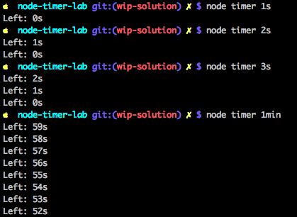

# Node CLI Timer App Lab

## Objectives

1. Implement a Node CLI timer app which works from CLI (take time and counts down like a kitchen timer)
2. Implement taking the CLI arguments: number of seconds or minutes
3. Implement the asynchronous sleep function so that the app knows when the time is up
4. Implement the current coutdown so that the users can see how much time is left

## Introduction

Imagine you've been hired to implement a timer app. The app must run on the super secret NASA server so it must be a command-line program. It must be flexible enough to accept different time intervals.
This app will be used by astronauts to cook food on a clandestine black ops mission.

In this project, we'll using `process` and timer functions to build a command-line interface application which takes a number of second or minutes and counts them down.

By now you should now how to access CLI arguments and use `setTimeout()`. Let's get to building the Timer app!

## Instructions

1. Create a CLI app which takes number of seconds in the following format: `ns` for n seconds, e.g., and `5s` for five seconds. The command for 5 seconds must look like `node timer 5s`.
2. Implement the timer in `timer.js` by printing the number of seconds left on a new line. For example, if you passed `10s` as your argument, you should see the text `"Left: 10s"`, `"Left: 9s"`, etc. printed to the console.
3. Use global objects `global.setInterval()` and `global.clearInterval()`
4. Enhance the app by adding minutes in the following format nmin, e.g., `1min` for 1 minute. The command for 1 minute must look like `node timer 1min`.
5. Utilize `process.exit()` to exit when there's an error and when there's no error but the time is up.
6. Use `process` to access arguments from the command line.
5. Test Timer with `npm test`

### Extra Info

You might want to consider using `setInterval()` and `clearInterval()` from Node Timers API which is identical to browser timer API. Most of front-end developers are already familiar with `setInterval()` so we won't duplicate and explain it here. But here are the links if you need a refresher:

* [Node Timers API](https://nodejs.org/api/timers.html)
* [JavaScript timers MDN](https://developer.mozilla.org/en-US/Add-ons/Code_snippets/Timers)

